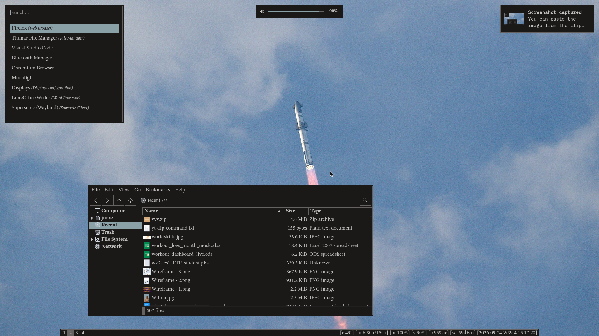

# Flatwork UI



Flatwork UI is a reusable Nix flake for a precise dark Niri desktop experience. It combines a machine-readable design system with Home Manager modules for GTK, Firefox, Waybar, Rofi, Mako, SwayOSD, Alacritty, Fastfetch, and a Bash prompt.

The visual direction is documented in [`DESIGN.MD`](./DESIGN.MD): flat surfaces, no rounded corners, 1px structural borders, STIX Two Text for human/interface language, IBM Plex Mono for technical language, muted colors, and a restrained workstation feel.

## Flake outputs

### Theme tokens

```nix
flatwork-ui.lib.themes.default
flatwork-ui.lib.themes.hue-gradient-design
flatwork-ui.lib.themes.gruvbox
flatwork-ui.lib.themes.starship
flatwork-ui.lib.themes.teal
flatwork-ui.lib.themes.orange
```

### Home Manager modules

Bundles:

```nix
flatwork-ui.homeManagerModules.default     # style + experience
flatwork-ui.homeManagerModules.style       # visual styling modules
flatwork-ui.homeManagerModules.experience  # full Firefox + Waybar experience
flatwork-ui.homeManagerModules.desktop     # GTK/Mako/Waybar/Rofi/SwayOSD
flatwork-ui.homeManagerModules.apps        # Alacritty/Firefox/Fastfetch/Bash prompt
```

Individual modules:

```nix
flatwork-ui.homeManagerModules.gtk
flatwork-ui.homeManagerModules.mako
flatwork-ui.homeManagerModules.waybar
flatwork-ui.homeManagerModules.rofi
flatwork-ui.homeManagerModules.swayosd
flatwork-ui.homeManagerModules.alacritty
flatwork-ui.homeManagerModules.firefox
flatwork-ui.homeManagerModules.fastfetch
flatwork-ui.homeManagerModules.bash-prompt
```

### NixOS modules

```nix
flatwork-ui.nixosModules.fonts
```

Installs the font set needed by the theme.

### Generated files

```nix
flatwork-ui.packages.${system}.css-vars
flatwork-ui.packages.${system}.palette-json
```

These are useful for consuming the palette from non-Nix/Home Manager projects.

## Full NixOS + Home Manager usage

```nix
{
  inputs = {
    nixpkgs.url = "github:nixos/nixpkgs/nixos-unstable";
    home-manager.url = "github:nix-community/home-manager";
    home-manager.inputs.nixpkgs.follows = "nixpkgs";

    flatwork-ui = {
      url = "github:jurrebuunk/flatwork-ui";
      inputs.nixpkgs.follows = "nixpkgs";
    };
  };

  outputs = inputs@{ nixpkgs, home-manager, flatwork-ui, ... }: {
    nixosConfigurations.myhost = nixpkgs.lib.nixosSystem {
      system = "x86_64-linux";
      specialArgs = {
        inherit inputs;
        theme = flatwork-ui.lib.themes.default;
      };
      modules = [
        flatwork-ui.nixosModules.fonts
        home-manager.nixosModules.home-manager
        {
          home-manager.useGlobalPkgs = true;
          home-manager.useUserPackages = true;
          home-manager.extraSpecialArgs = {
            inherit inputs;
            theme = flatwork-ui.lib.themes.default;
          };

          home-manager.users.me = {
            imports = [
              flatwork-ui.homeManagerModules.default
            ];

            home.username = "me";
            home.homeDirectory = "/home/me";
            home.stateVersion = "24.05";
          };
        }
      ];
    };
  };
}
```

## Toggling modules

Most modules expose options under `flatwork.*` and are enabled by default when imported:

```nix
{
  flatwork.firefox.enable = false;
  flatwork.fastfetch.enable = false;
  flatwork.rofi.enable = true;
}
```

## Waybar hardware overrides

The full Waybar module assumes Niri and defaults to Jurre's laptop module layout. Override hardware-sensitive pieces when needed:

```nix
{
  # Let Waybar auto-detect the temperature sensor.
  flatwork.waybar.temperature.hwmonPath = null;

  # Or set a specific sensor path.
  # flatwork.waybar.temperature.hwmonPath = "/sys/devices/platform/k10temp.0/hwmon/hwmon3";

  flatwork.waybar.modulesRight = [
    "memory"
    "pulseaudio"
    "battery"
    "network"
    "clock"
  ];
}
```

## Using only theme tokens

If you only want the palette/fonts/layout tokens, pass the theme through `extraSpecialArgs` and write your own modules:

```nix
home-manager.extraSpecialArgs = {
  theme = inputs.flatwork-ui.lib.themes.default;
};
```

Then consume it:

```nix
{ theme, ... }:

{
  programs.alacritty.settings.colors.primary = {
    background = theme.colors.terminal.background;
    foreground = theme.colors.terminal.foreground;
  };
}
```

## Using CSS variables outside Home Manager

```bash
nix build github:jurrebuunk/flatwork-ui#css-vars
cat result
```

For JSON:

```bash
nix build github:jurrebuunk/flatwork-ui#palette-json
cat result
```

## Theme schema

See [`docs/theme-schema.md`](./docs/theme-schema.md).

## Checks

```bash
nix flake check
```

The flake includes checks for hardcoded local paths and old theme-schema references.
